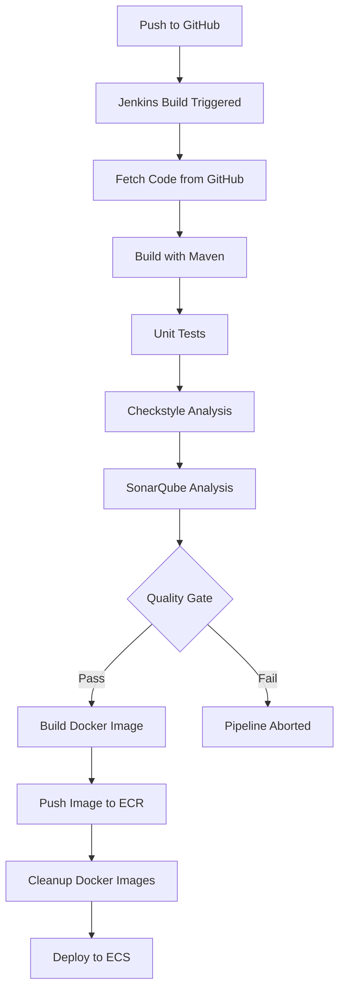

# Jenkins CI/CD Pipeline: Dockerize & Deploy Java App to AWS ECS


**Continuation of:** [CI Pipeline with Jenkins, SonarQube & Nexus](https://github.com/tentinqu/ci-pipeline.git)

This project extends the CI foundation by containerizing the Java web app (vProfile) and automating deployment to AWS ECS using Jenkins.

## What's New in This Project?

In the previous repository, the CI pipeline stopped after code analysis and artifact upload. This project adds:

-  **Dockerization**: .war packaged into a Docker image
-  **Push to AWS ECR**: Versioned image uploaded to registry
-  **Deploy to AWS ECS**: ECS service updated with new image
-  **CD Automation**: Fully automated deployment via Jenkins

## Technology Stack (Additions)

| Tool          | Purpose                          |
|---------------|----------------------------------|
| Docker        | Containerize the application    |
| Amazon ECR    | Store Docker images              |
| Amazon ECS    | Run app in containers            |
| AWS CLI       | Scripted deployment             |

*Existing tools (Maven, GitHub, SonarQube, Jenkins) remain unchanged - see [original project](https://github.com/tentinqu/ci-pipeline.git) for details.*

## Pipeline Overview




## Key File
Jenkinsfile – Extended to include Docker + CD steps

## Jenkins Pipeline: New Stages
### Docker Build

```groovy
sh 'docker build -t $ECR_REPO:$VERSION .'
```
### ECR Push
```
groovy
docker.withRegistry(vprofileRegistry, registryCredential)
 {
                        dockerImage.push("$BUILD_NUMBER")
                        dockerImage.push('latest')
}
```

### ECS Deployment
```groovy
withAWS(credentials: 'awscreds', region: 'us-east-1')
{
                    sh 'aws ecs update-service --cluster ${cluster} --service ${service} --force-new-deployment'
}
```

### Includes:
- Registering new task definition revision
- Forcing ECS to pull new image and restart tasks

### Parameterized Build Example
Parameter	Description
VERSION	Tag for Docker and ECS deployment (v2.0.0, etc.)

### Prerequisites
Jenkins with AWS CLI, Docker, and IAM role for ECS & ECR


* ECR repository created and linked

* ECS Cluster, Service & Task Definition already configured

* .war file output from Maven build

### Access & Monitoring
Component	Access Method
Jenkins	http://jenkins.harshitch.xyz:8080
ECS App	Via Load Balancer or Public IP
ECR	AWS Console or CLI


## For CI Setup, SonarQube Integration & Nexus Upload
Refer to the original project:
[CI with Jenkins + SonarQube + Nexus](https://github.com/tentinqu/ci-pipeline.git)

Check out the original project [here](https://github.com/hkhcoder/vprofile-project.git)

Read the full write-up [here](https://www.notion.so/CI-CD-with-Docker-Jenkins-AWS-Full-Pipeline-Breakdown-1f77d8e8dcad805891d0f58b706134a0?pvs=4)


